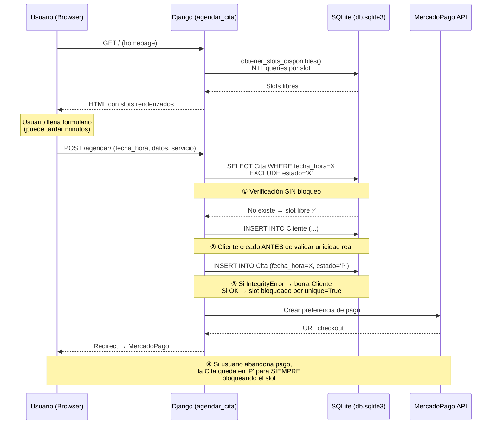
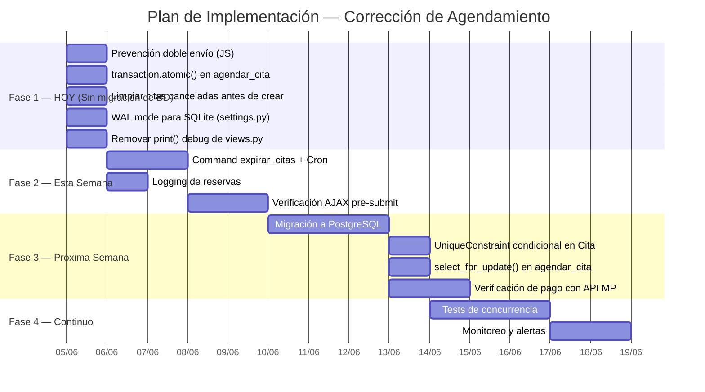

# 🔍 Diagnóstico: Falso Conflicto en el Sistema de Agendamiento

**Proyecto:** Asesorías TS (asesora-moyano.wearesamod.com)  
**Stack:** Django 5.2 · SQLite · MercadoPago · Tailwind CDN · Server-side rendering  
**Fecha del análisis:** 5 de junio de 2026  
**Severidad global:** 🔴 Crítica  

---

## 1. Resumen Ejecutivo

El sistema de agendamiento de citas presenta un defecto intermitente: al intentar reservar un bloque horario que **realmente está disponible**, el usuario recibe alguno de estos mensajes:

> *"¡Ups! Esa hora acaba de ser reservada por otra persona mientras leías."*  
> *"Esa hora se ocupó en este preciso instante. Selecciona otra disponibilidad."*

Tras un análisis exhaustivo de todo el código fuente — modelos, vistas, formularios, templates y configuración — se identificaron **siete causas raíz** que, combinadas, producen este comportamiento. El origen principal es una cadena de vulnerabilidades en la función [`agendar_cita`](file:///D:/Proyectos/Paginas/Ficheros%20Django/asesora-ts/asesorias/views.py#L40-L131):

1. **Race condition TOCTOU** (verificación sin bloqueo → ventana para colisión).
2. **Constraint `unique=True` demasiado amplio** (bloquea slots cancelados para siempre).
3. **Citas pendientes de pago que nunca expiran** (slots fantasma).
4. **Sin transacción atómica** (estados parciales ante fallos).
5. **Sin protección contra doble envío** en el frontend.
6. **SQLite en producción** (bloqueo a nivel de archivo).
7. **Datos obsoletos (stale data)** al usuario mientras llena el formulario.

El sistema **no tiene un solo bug**, sino una acumulación de debilidades de diseño típicas en sistemas de reservas construidos sin patrones de concurrencia.

---

## 2. Arquitectura Actual del Flujo de Reserva



---

## 3. Causas Raíz Identificadas (Priorizadas)

### 3.1 🔴 CRÍTICA — Race Condition TOCTOU en `agendar_cita`

> **Archivos:** [`views.py` L40-72](file:///D:/Proyectos/Paginas/Ficheros%20Django/asesora-ts/asesorias/views.py#L40-L72)

La vista ejecuta un patrón **check-then-act** sin ninguna protección de concurrencia:

```python
# L51: VERIFICAR — lectura sin bloqueo
if Cita.objects.filter(fecha_hora=fecha_hora_obj).exclude(estado='X').exists():
    # → "hora ya reservada"

# L57-66: ACTUAR — escritura sin transacción
cliente = form.save()
cita = Cita.objects.create(
    cliente=cliente,
    fecha_hora=fecha_hora_obj,  # unique=True es la única protección
    estado='P',
    estado_pago='NO'
)
```

**Ventana de carrera:**

```
Tiempo  │  Usuario A                    │  Usuario B
────────┼───────────────────────────────┼─────────────────────────────────
t₁      │  .filter().exists() → False   │
t₂      │                               │  .filter().exists() → False  ←⚠️
t₃      │  form.save() → Cliente A      │  form.save() → Cliente B
t₄      │  Cita.create() → OK ✅        │
t₅      │                               │  Cita.create() → IntegrityError ❌
t₆      │                               │  cliente_b.delete() → Cliente B huérfano eliminado
```

El usuario B ve **"Esa hora se ocupó en este preciso instante"**, pero desde su perspectiva la hora estaba libre cuando cargó la página (y lo estaba). El `IntegrityError` (L68) es la **única red de seguridad** real, y funciona, pero el UX es malo: el usuario ya llenó todo el formulario.

**Agravante:** El `IntegrityError` solo captura `Cita.objects.create()`. Si la excepción ocurre por otra razón (error de SQLite, constraint de FK, etc.), el sistema la confunde con un conflicto de horario.

---

### 3.2 🔴 CRÍTICA — `unique=True` en `fecha_hora` Bloquea Citas Canceladas

> **Archivo:** [`models.py` L87](file:///D:/Proyectos/Paginas/Ficheros%20Django/asesora-ts/asesorias/models.py#L87)

```python
fecha_hora = models.DateTimeField(unique=True)
```

Este constraint prohíbe que existan **dos citas con el mismo datetime**, sin importar su estado. Pero la lógica de negocio en la vista (L51) usa `.exclude(estado='X')`, implicando que las citas canceladas **deberían** liberar el slot.

**Conflicto:**

| Situación | Resultado |
|---|---|
| Cita creada en estado `P` (Pendiente) | Slot bloqueado ✅ |
| Cita pasa a `X` (Cancelada) por fallo de pago | Slot **sigue bloqueado en la BD** por `unique=True` ❌ |
| Otro usuario intenta reservar ese mismo horario | `IntegrityError` → "hora ocupada" ❌ |
| `obtener_slots_disponibles()` muestra el slot como libre (usa `.exclude(estado='X')`) | El slot aparece disponible pero **es imposible reservarlo** 💥 |

**Este es el escenario exacto del bug reportado:** el usuario ve la hora como disponible, intenta reservar, y el sistema dice que ya está ocupada.

---

### 3.3 🔴 CRÍTICA — Citas Pendientes de Pago que Nunca Expiran (Slots Fantasma)

> **Archivo:** [`views.py` L60-66](file:///D:/Proyectos/Paginas/Ficheros%20Django/asesora-ts/asesorias/views.py#L60-L66)

Cuando un usuario completa el formulario, se crea una `Cita` con `estado='P'` y `estado_pago='NO'`, y se redirige a MercadoPago. Si el usuario:

- Cierra la pestaña antes de pagar
- Abandona el checkout de MercadoPago
- Su sesión de MercadoPago expira
- El webhook de MercadoPago no llega (problemas de red, URL incorrecta, etc.)

La cita queda **permanentemente en estado `P` con pago `NO`**, bloqueando ese slot por `unique=True`. No existe:
- Cron job ni tarea celery para expirar citas pendientes
- Timeout de expiración en el modelo
- Verificación periódica del estado del pago con la API de MercadoPago

**Impacto estimado:** Con el tiempo, se acumulan "citas fantasma" que bloquean progresivamente más slots, haciendo el sistema cada vez menos funcional.

---

### 3.4 🟡 ALTA — Sin Transacción Atómica (Estados Parciales)

> **Archivo:** [`views.py` L56-66](file:///D:/Proyectos/Paginas/Ficheros%20Django/asesora-ts/asesorias/views.py#L56-L66)

El flujo crea un `Cliente` (L57) y luego una `Cita` (L60-66) como operaciones independientes (autocommit). Si algo falla entre ambas:

```python
cliente = form.save()              # ← Commit 1: Cliente creado
servicio_obj = Servicio.objects.get(nombre=nombre_servicio)  # ← Puede lanzar DoesNotExist (no capturado)
cita = Cita.objects.create(...)    # ← Commit 2: Cita creada (o IntegrityError)
```

**Problemas:**
- Si `Servicio.objects.get()` falla (nombre con caracteres especiales, servicio eliminado), el `Cliente` queda huérfano.
- El `except IntegrityError` (L68) hace `cliente.delete()`, pero si el delete falla, el Cliente queda huérfano.
- El mismo patrón aplica en las vistas de pago (`pago_exito`, `pago_fallo`, `mercadopago_webhook`) que modifican estado de cita + estado de pago sin transacción.

---

### 3.5 🟡 ALTA — Sin Protección contra Doble Envío (Frontend)

> **Archivo:** Template `index.html` (botón de envío del formulario de reserva)

El botón de envío del formulario de reserva no tiene **ningún** mecanismo de protección:

- No se deshabilita tras el primer clic
- No hay variable de control JavaScript (`submitted = true`)
- No hay spinner ni indicador de carga
- No hay token de idempotencia

**Flujo del problema:**
1. El usuario hace clic en "Reservar" → POST enviado
2. La respuesta tarda (MercadoPago API, latencia de red)
3. El usuario hace clic de nuevo → segundo POST enviado
4. El primer POST crea la cita exitosamente
5. El segundo POST encuentra `IntegrityError` → "hora ya ocupada"
6. El usuario ve el mensaje de error sin saber que su reserva **sí se creó**

---

### 3.6 🟡 MEDIA — SQLite en Producción (Concurrencia Limitada)

> **Archivo:** [`settings.py` L80-85](file:///D:/Proyectos/Paginas/Ficheros%20Django/asesora-ts/core/settings.py#L80-L85)

```python
DATABASES = {
    'default': {
        'ENGINE': 'django.db.backends.sqlite3',
        'NAME': BASE_DIR / 'db.sqlite3',
    }
}
```

| Limitación de SQLite | Impacto en la App |
|---|---|
| Bloqueo a nivel de **archivo completo** durante escrituras | Dos POST simultáneos: uno espera hasta 5s (timeout por defecto) |
| `select_for_update()` **no soportado** | Imposible implementar bloqueo pesimista de filas |
| `OperationalError: database is locked` bajo carga | Se puede confundir con un conflicto de horario |
| Sin constraints condicionales (`UniqueConstraint` con `condition`) | No se puede hacer `unique WHERE estado != 'X'` |

---

### 3.7 🟢 BAJA — Datos Obsoletos (Stale Data) en el Frontend

> **Archivo:** [`views.py` L242-289](file:///D:/Proyectos/Paginas/Ficheros%20Django/asesora-ts/asesorias/views.py#L242-L289) + template `index.html`

Los slots se renderizan una sola vez al cargar la página. Si el usuario tarda 10 minutos llenando el formulario, los slots mostrados pueden estar desactualizados. No hay:

- Polling AJAX para refrescar disponibilidad
- WebSocket para notificaciones en tiempo real
- Timeout en la página para forzar recarga
- Verificación client-side antes del submit

---

## 4. Soluciones Propuestas

### 4.1 🔴 [P0] Reemplazar `unique=True` por un Constraint Condicional + Limpiar Citas Fantasma

**Esfuerzo:** Medio (1-2h)  
**Impacto:** 🟢 Elimina la causa raíz principal del bug reportado  
**Prerrequisito:** Migrar a PostgreSQL (ver 4.6)

Este es el cambio **más importante**. La restricción `unique=True` absoluta impide reutilizar slots de citas canceladas, que es exactamente el bug reportado.

**Paso 1:** Cambiar el modelo `Cita`

```python
# asesorias/models.py
class Cita(models.Model):
    ESTADOS = [('P', 'Pendiente'), ('C', 'Confirmada'), ('X', 'Cancelada')]
    ESTADOS_PAGO = [('NO', 'No Pagado'), ('PE', 'Pago Pendiente'),
                    ('PA', 'Pagado'), ('RE', 'Reembolsado')]

    cliente = models.ForeignKey(Cliente, on_delete=models.CASCADE)
    servicio = models.ForeignKey(Servicio, on_delete=models.PROTECT)
    fecha_hora = models.DateTimeField()  # ← Ya NO es unique=True
    estado = models.CharField(max_length=1, choices=ESTADOS, default='P')
    estado_pago = models.CharField(max_length=2, choices=ESTADOS_PAGO, default='NO')
    transaccion_id = models.CharField(max_length=100, blank=True, null=True)
    mp_preference_id = models.CharField(max_length=100, blank=True, null=True)

    class Meta:
        constraints = [
            models.UniqueConstraint(
                fields=['fecha_hora'],
                condition=models.Q(estado__in=['P', 'C']),
                name='unique_cita_activa_por_horario'
            )
        ]
```

> [!IMPORTANT]
> `UniqueConstraint` con `condition` requiere **PostgreSQL**. No funciona con SQLite. Si la migración a PostgreSQL no es inmediata, implementar la solución temporal de limpieza descrita más abajo.

**Paso 2:** Solución temporal para SQLite — script de limpieza de citas fantasma

```python
# management/commands/limpiar_citas_fantasma.py
from django.core.management.base import BaseCommand
from django.utils import timezone
from datetime import timedelta
from asesorias.models import Cita

class Command(BaseCommand):
    help = 'Cancela citas pendientes de pago con más de 30 minutos de antigüedad'

    def handle(self, *args, **options):
        limite = timezone.now() - timedelta(minutes=30)
        fantasma = Cita.objects.filter(
            estado='P',
            estado_pago='NO',
            fecha_hora__lte=limite  # Hora de la cita ya pasó o fue creada hace rato
        )
        count = fantasma.update(estado='X')
        self.stdout.write(f'Canceladas {count} citas fantasma')
```

Ejecutar vía cron cada 15 minutos:
```bash
*/15 * * * * cd /path/to/project && python manage.py limpiar_citas_fantasma
```

**Paso 3:** Solución inmediata para SQLite — eliminar citas canceladas al reservar

Mientras se mantiene `unique=True`, antes de crear la cita verificar y eliminar citas canceladas:

```python
# En agendar_cita, antes de Cita.objects.create():
Cita.objects.filter(fecha_hora=fecha_hora_obj, estado='X').delete()
```

---

### 4.2 🔴 [P0] Envolver la Reserva en Transacción Atómica

**Esfuerzo:** Bajo (30 min)  
**Impacto:** 🟢 Elimina estados parciales e inconsistencias

```python
# asesorias/views.py
from django.db import transaction, IntegrityError

def agendar_cita(request):
    if request.method == 'POST':
        form = FormularioDiagnostico(request.POST)
        fecha_hora_str = request.POST.get('fecha_hora_reserva')
        nombre_servicio = request.POST.get('servicio')

        if form.is_valid() and fecha_hora_str and nombre_servicio:
            fecha_hora_obj = timezone.make_aware(
                datetime.strptime(fecha_hora_str, '%Y-%m-%d %H:%M:%S'))

            try:
                with transaction.atomic():
                    # Verificar disponibilidad DENTRO de la transacción
                    if Cita.objects.filter(
                        fecha_hora=fecha_hora_obj
                    ).exclude(estado='X').exists():
                        raise ValueError("Hora no disponible")

                    # Limpiar citas canceladas en este slot (permite reutilización con unique=True)
                    Cita.objects.filter(fecha_hora=fecha_hora_obj, estado='X').delete()

                    cliente = form.save()
                    servicio_obj = Servicio.objects.get(nombre=nombre_servicio)

                    cita = Cita.objects.create(
                        cliente=cliente,
                        servicio=servicio_obj,
                        fecha_hora=fecha_hora_obj,
                        estado='P',
                        estado_pago='NO'
                    )

            except (ValueError, IntegrityError):
                messages.error(
                    request,
                    "¡Ups! Esa hora acaba de ser reservada. Por favor, selecciona otra."
                )
                return redirect(reverse('home') + '#seccion-reserva')

            except Servicio.DoesNotExist:
                messages.error(request, "El servicio seleccionado no existe.")
                return redirect(reverse('home') + '#seccion-reserva')

            # --- MERCADO PAGO (fuera de la transacción DB) ---
            try:
                sdk = mercadopago.SDK(settings.MP_ACCESS_TOKEN)
                site_url = settings.SITE_URL
                # ... (resto del código de MercadoPago sin cambios) ...
                preference_data = { ... }
                preference_response = sdk.preference().create(preference_data)

                if preference_response.get("status") not in (200, 201):
                    raise Exception(f"MP error: {preference_response.get('status')}")

                preference = preference_response["response"]
                cita.mp_preference_id = preference["id"]
                cita.save()

                url_checkout = preference["sandbox_init_point"] if settings.DEBUG else preference["init_point"]
                return redirect(url_checkout)

            except Exception as e:
                cita.estado = 'X'
                cita.save()
                messages.error(request, f"Error con Mercado Pago: {str(e)}")
                return redirect(reverse('home') + '#seccion-reserva')

        else:
            messages.error(request, "Completa todos los campos correctamente.")
            return redirect(reverse('home') + '#seccion-reserva')

    return redirect('home')
```

> [!NOTE]
> La integración con MercadoPago se deja **fuera** del `transaction.atomic()` intencionalmente: las llamadas HTTP externas no deben estar dentro de transacciones de BD porque si la transacción se revierte, la preferencia de pago ya fue creada en MercadoPago y no se puede deshacer automáticamente.

---

### 4.3 🟡 [P1] Prevención de Doble Envío en el Frontend

**Esfuerzo:** Bajo (20 min)  
**Impacto:** 🟢 Elimina el caso más común de falso conflicto (doble clic)

Agregar JavaScript en el template `index.html`, en el bloque del formulario de reserva:

```html
<script>
(function() {
    const form = document.querySelector('form[action*="agendar"]');
    if (!form) return;

    let submitted = false;

    form.addEventListener('submit', function(e) {
        if (submitted) {
            e.preventDefault();
            return false;
        }
        submitted = true;

        // Cambiar apariencia del botón
        const btn = form.querySelector('button[type="submit"]');
        if (btn) {
            btn.disabled = true;
            btn.innerHTML = `
                <svg class="animate-spin -ml-1 mr-2 h-5 w-5 text-white inline" xmlns="http://www.w3.org/2000/svg" fill="none" viewBox="0 0 24 24">
                    <circle class="opacity-25" cx="12" cy="12" r="10" stroke="currentColor" stroke-width="4"></circle>
                    <path class="opacity-75" fill="currentColor" d="M4 12a8 8 0 018-8V0C5.373 0 0 5.373 0 12h4zm2 5.291A7.962 7.962 0 014 12H0c0 3.042 1.135 5.824 3 7.938l3-2.647z"></path>
                </svg>
                Procesando...
            `;
        }
    });

    // Rehabilitar si el usuario vuelve con botón "atrás"
    window.addEventListener('pageshow', function(e) {
        if (e.persisted) {
            submitted = false;
            const btn = form.querySelector('button[type="submit"]');
            if (btn) {
                btn.disabled = false;
                btn.textContent = 'Reservar Ahora';
            }
        }
    });
})();
</script>
```

---

### 4.4 🟡 [P1] Expiración Automática de Citas Pendientes

**Esfuerzo:** Medio (1h)  
**Impacto:** 🟢 Libera slots bloqueados por abandonos de pago

**Opción A — Management Command + Cron** (simple, funciona con cualquier hosting):

```python
# asesorias/management/commands/expirar_citas.py
from django.core.management.base import BaseCommand
from django.utils import timezone
from datetime import timedelta
from asesorias.models import Cita

class Command(BaseCommand):
    help = 'Expira citas pendientes de pago tras 30 minutos'

    def add_arguments(self, parser):
        parser.add_argument('--minutes', type=int, default=30,
                            help='Minutos antes de expirar (default: 30)')

    def handle(self, *args, **options):
        minutos = options['minutes']
        limite = timezone.now() - timedelta(minutes=minutos)

        # Citas pendientes sin pago, creadas hace más de N minutos
        citas_expiradas = Cita.objects.filter(
            estado='P',
            estado_pago__in=['NO', 'PE'],
        ).exclude(
            fecha_hora__gt=timezone.now()  # No expirar citas futuras recién creadas
        )

        # Alternativa más segura: filtrar por un campo created_at si existiera
        count = citas_expiradas.update(estado='X')
        self.stdout.write(self.style.SUCCESS(f'{count} citas expiradas'))
```

> [!TIP]
> **Mejora recomendada:** Agregar un campo `creada_en = models.DateTimeField(auto_now_add=True)` al modelo `Cita` para poder filtrar por antigüedad real de creación, no por la hora de la cita.

**Opción B — Verificación inline** (sin cron, funciona inmediatamente):

Agregar en `obtener_slots_disponibles()`:

```python
def obtener_slots_disponibles():
    # Auto-expirar citas pendientes > 30 min antes de calcular slots
    from datetime import timedelta
    Cita.objects.filter(
        estado='P',
        estado_pago='NO',
        fecha_hora__lt=timezone.now() - timedelta(minutes=30)
    ).update(estado='X')

    # ... resto del cálculo de slots ...
```

---

### 4.5 🟡 [P2] Verificación de Disponibilidad Pre-Submit (AJAX)

**Esfuerzo:** Medio (1-2h)  
**Impacto:** 🟡 Mejora UX reduciendo la ventana de stale data

**Nuevo endpoint:**

```python
# asesorias/views.py
from django.http import JsonResponse

def verificar_slot(request):
    """Verifica si un slot sigue disponible (llamado vía AJAX antes del submit)."""
    fecha_hora_str = request.GET.get('fecha_hora')
    if not fecha_hora_str:
        return JsonResponse({'disponible': False, 'error': 'Parámetro faltante'}, status=400)

    try:
        fecha_hora_obj = timezone.make_aware(
            datetime.strptime(fecha_hora_str, '%Y-%m-%d %H:%M:%S'))
        disponible = not Cita.objects.filter(
            fecha_hora=fecha_hora_obj
        ).exclude(estado='X').exists()
        return JsonResponse({'disponible': disponible})
    except (ValueError, TypeError):
        return JsonResponse({'disponible': False, 'error': 'Formato inválido'}, status=400)
```

```python
# asesorias/urls.py
path('api/verificar-slot/', views.verificar_slot, name='verificar_slot'),
```

**JavaScript en el template:**

```javascript
// Interceptar submit para verificar disponibilidad primero
form.addEventListener('submit', async function(e) {
    e.preventDefault();

    const fechaHora = document.getElementById('input_fecha_hora').value;
    if (!fechaHora) return;

    try {
        const resp = await fetch(`/api/verificar-slot/?fecha_hora=${encodeURIComponent(fechaHora)}`);
        const data = await resp.json();

        if (!data.disponible) {
            alert('Este horario acaba de ser tomado por otra persona. La página se recargará.');
            window.location.reload();
            return;
        }
    } catch (err) {
        // Si la verificación falla por red, dejar pasar (el servidor validará)
    }

    // Si sigue disponible, enviar formulario
    this.submit();
});
```

---

### 4.6 🟡 [P2] Migrar de SQLite a PostgreSQL

**Esfuerzo:** Medio (2-4h)  
**Impacto:** 🟢 Habilita bloqueo a nivel de fila, constraints condicionales, mejor concurrencia

**Paso 1:** Instalar dependencias
```bash
pip install psycopg2-binary
```

**Paso 2:** Actualizar `settings.py`
```python
DATABASES = {
    'default': {
        'ENGINE': 'django.db.backends.postgresql',
        'NAME': os.getenv('DB_NAME', 'asesora_ts'),
        'USER': os.getenv('DB_USER', 'postgres'),
        'PASSWORD': os.getenv('DB_PASSWORD', ''),
        'HOST': os.getenv('DB_HOST', 'localhost'),
        'PORT': os.getenv('DB_PORT', '5432'),
    }
}
```

**Paso 3:** Migrar datos
```bash
# Exportar desde SQLite
python manage.py dumpdata --natural-foreign --natural-primary -e contenttypes -e auth.Permission -o backup.json

# Cambiar settings.py a PostgreSQL, crear la BD, y migrar
python manage.py migrate
python manage.py loaddata backup.json
```

> [!TIP]
> **Si PostgreSQL no es viable en este hosting**, una mejora parcial inmediata es activar WAL mode y aumentar el timeout de SQLite:
> ```python
> # Al final de settings.py
> from django.db.backends.signals import connection_created
>
> def configurar_sqlite(sender, connection, **kwargs):
>     if connection.vendor == 'sqlite':
>         cursor = connection.cursor()
>         cursor.execute('PRAGMA journal_mode=WAL;')
>         cursor.execute('PRAGMA busy_timeout=15000;')  # 15 segundos
>
> connection_created.connect(configurar_sqlite)
> ```
> Esto mejora significativamente la concurrencia de SQLite (múltiples lectores + 1 escritor simultáneo) y reduce los errores `database is locked`.

---

### 4.7 🟢 [P3] Hardening Adicional: Seguridad del Flujo de Pago

**Esfuerzo:** Medio (1-2h)  
**Impacto:** 🟡 Previene manipulación del estado de pago

**Problema actual:** `pago_exito` acepta parámetros GET arbitrarios sin verificación:

```python
# views.py L159-172 — VULNERABLE
def pago_exito(request):
    payment_id = request.GET.get('payment_id')  # ← Cualquiera puede fabricar esto
    external_ref = request.GET.get('external_reference')
    if external_ref:
        cita = Cita.objects.filter(id=external_ref).first()
        if cita and cita.estado_pago != 'PA':
            cita.estado_pago = 'PA'  # ← Marcada como pagada sin verificar con MP
            cita.estado = 'C'
```

**Solución:** Verificar el pago con la API de MercadoPago antes de confirmar:

```python
def pago_exito(request):
    payment_id = request.GET.get('payment_id')
    external_ref = request.GET.get('external_reference')

    if external_ref and payment_id:
        cita = Cita.objects.filter(id=external_ref).first()
        if cita and cita.estado_pago != 'PA':
            # Verificar con la API de MercadoPago que el pago es real
            try:
                sdk = mercadopago.SDK(settings.MP_ACCESS_TOKEN)
                payment_info = sdk.payment().get(int(payment_id))
                payment = payment_info.get('response', {})

                if (payment.get('status') == 'approved' and
                    payment.get('external_reference') == str(cita.id)):
                    cita.estado_pago = 'PA'
                    cita.estado = 'C'
                    cita.transaccion_id = str(payment_id)
                    cita.save()
                    _enviar_email_confirmacion(cita)
            except Exception:
                pass  # El webhook se encargará

    return render(request, 'pago/exito.html')
```

---

## 5. Plan de Verificación

### 5.1 Test de Concurrencia (Automatizado)

```python
# asesorias/tests/test_concurrencia.py
import threading
from django.test import TransactionTestCase, Client
from django.utils import timezone
from datetime import datetime, timedelta
from asesorias.models import Cita, Cliente, Servicio, HorarioAtencion


class TestReservaConcurrente(TransactionTestCase):
    """Verifica que solo UNA reserva simultánea tenga éxito para el mismo slot."""

    def setUp(self):
        self.servicio = Servicio.objects.create(
            nombre="Asesoría Test", descripcion="Test", precio=10000
        )
        HorarioAtencion.objects.create(
            dia_semana=0, hora_inicio="09:00", hora_fin="17:00", activo=True
        )
        # Slot para el próximo lunes a las 10:00
        hoy = timezone.now().date()
        dias_hasta_lunes = (7 - hoy.weekday()) % 7 or 7
        self.fecha_test = hoy + timedelta(days=dias_hasta_lunes)
        self.fecha_hora_str = f"{self.fecha_test} 10:00:00"

    def _hacer_reserva(self, num, resultados, lock):
        client = Client()
        response = client.post('/agendar/', {
            'nombre': f'Cliente Test {num}',
            'email': f'test{num}@example.com',
            'telefono': '+56912345678',
            'rut': '11111111-1',  # Usar RUT válido para test
            'motivo_consulta': 'Test de concurrencia',
            'fecha_hora_reserva': self.fecha_hora_str,
            'servicio': 'Asesoría Test',
        }, follow=False)

        with lock:
            if response.status_code == 302 and 'mercadopago' not in str(response.url):
                resultados['errores'] += 1
            else:
                resultados['exitos'] += 1

    def test_solo_una_reserva_gana(self):
        resultados = {'exitos': 0, 'errores': 0}
        lock = threading.Lock()

        hilos = [
            threading.Thread(target=self._hacer_reserva, args=(i, resultados, lock))
            for i in range(5)
        ]
        for h in hilos:
            h.start()
        for h in hilos:
            h.join()

        # Máximo 1 cita activa por slot
        citas_activas = Cita.objects.filter(
            fecha_hora__contains=self.fecha_test
        ).exclude(estado='X').count()
        self.assertLessEqual(citas_activas, 1,
            "¡Se creó más de una cita activa para el mismo slot!")
```

### 5.2 Test del Bug de Cita Cancelada que Bloquea Slot

```python
class TestSlotCanceladoLiberable(TransactionTestCase):
    """Verifica que un slot cancelado pueda ser reutilizado."""

    def setUp(self):
        self.servicio = Servicio.objects.create(
            nombre="Test", descripcion="Test", precio=10000
        )
        self.cliente = Cliente.objects.create(
            nombre="Test", rut="11111111-1", email="t@t.com",
            telefono="123", motivo_consulta="test"
        )
        self.fecha_hora = timezone.make_aware(datetime(2026, 7, 1, 10, 0, 0))

    def test_slot_cancelado_se_puede_reusar(self):
        # Crear cita y cancelarla
        cita = Cita.objects.create(
            cliente=self.cliente, servicio=self.servicio,
            fecha_hora=self.fecha_hora, estado='P', estado_pago='NO'
        )
        cita.estado = 'X'
        cita.save()

        # Debe poderse crear otra cita en el mismo slot
        # (requiere que la solución 4.1 esté implementada)
        cita2 = Cita.objects.create(
            cliente=self.cliente, servicio=self.servicio,
            fecha_hora=self.fecha_hora, estado='P', estado_pago='NO'
        )
        self.assertEqual(cita2.estado, 'P')
```

### 5.3 Verificación Manual

| # | Paso | Resultado Esperado | ¿Pasa? |
|---|------|-------------------|--------|
| 1 | Abrir la web en 2 navegadores diferentes | Ambos ven los mismos slots disponibles | |
| 2 | Navegador A selecciona 10:00 y envía | Redirige a MercadoPago | |
| 3 | Navegador B selecciona 10:00 y envía | Mensaje "hora ya reservada" (NO debe decir que hay un error desconocido) | |
| 4 | Navegador A abandona pago de MercadoPago | Cita queda en P/NO | |
| 5 | Esperar 30+ minutos (o ejecutar `expirar_citas`) | Cita pasa a X | |
| 6 | Navegador B recarga la página | Slot 10:00 aparece como disponible de nuevo | |
| 7 | Navegador B reserva 10:00 | Funciona correctamente | |
| 8 | Doble clic rápido en "Reservar" | Solo se envía un POST (botón deshabilitado tras primer clic) | |

### 5.4 Logging Recomendado

```python
# asesorias/views.py — al inicio del archivo
import logging
logger = logging.getLogger('asesorias.reservas')

# En agendar_cita, agregar logs estratégicos:
def agendar_cita(request):
    if request.method == 'POST':
        fecha_hora_str = request.POST.get('fecha_hora_reserva')
        logger.info(
            f"RESERVA_INTENTO | slot={fecha_hora_str} | "
            f"IP={request.META.get('REMOTE_ADDR')} | "
            f"servicio={request.POST.get('servicio')}"
        )

        # ... dentro del try/except ...
        # En caso de éxito:
        logger.info(f"RESERVA_OK | cita_id={cita.id} | slot={fecha_hora_str}")

        # En caso de IntegrityError:
        logger.warning(f"RESERVA_CONFLICTO | slot={fecha_hora_str} | tipo=IntegrityError")

        # En caso de slot ya ocupado (exists check):
        logger.warning(f"RESERVA_CONFLICTO | slot={fecha_hora_str} | tipo=exists_check")
```

```python
# settings.py — configuración de logging
LOGGING = {
    'version': 1,
    'disable_existing_loggers': False,
    'formatters': {
        'verbose': {
            'format': '{asctime} {levelname} {name} {message}',
            'style': '{',
        },
    },
    'handlers': {
        'file': {
            'level': 'INFO',
            'class': 'logging.FileHandler',
            'filename': BASE_DIR / 'logs' / 'reservas.log',
            'formatter': 'verbose',
        },
    },
    'loggers': {
        'asesorias.reservas': {
            'handlers': ['file'],
            'level': 'INFO',
            'propagate': False,
        },
    },
}
```

---

## 6. Matriz de Priorización

| # | Solución | Prioridad | Esfuerzo | Depende de | Impacto |
|---|----------|-----------|----------|------------|---------|
| 4.1 | Limpiar citas canceladas antes de crear + constraint condicional | 🔴 P0 | Medio | PostgreSQL (para constraint) | Elimina causa raíz del bug |
| 4.2 | `transaction.atomic()` en `agendar_cita` | 🔴 P0 | Bajo | — | Elimina estados parciales |
| 4.3 | Prevención doble envío (frontend JS) | 🟡 P1 | Bajo | — | Elimina duplicados por doble clic |
| 4.4 | Expiración automática de citas pendientes | 🟡 P1 | Medio | — | Libera slots fantasma |
| 4.5 | Verificación AJAX pre-submit | 🟡 P2 | Medio | — | Mejora UX, reduce stale data |
| 4.6 | Migración a PostgreSQL | 🟡 P2 | Medio | — | Habilita bloqueos y constraints |
| 4.7 | Verificación de pago con API de MP | 🟢 P3 | Medio | — | Previene fraude en pagos |

---

## 7. Orden de Implementación Recomendado



---

## 8. Recomendaciones Adicionales

### Monitoreo
- **Log de todas las reservas** con IP, timestamp, slot, resultado (éxito/conflicto/error).
- **Alerta** si el ratio de conflictos supera el 5% de intentos en un periodo de 1h.
- **Dashboard admin** con métricas: citas creadas vs. abandonadas vs. conflictos por día.
- **Health check** periódico: contar citas en estado `P` con `estado_pago='NO'` > 1h de antigüedad.

### Seguridad
- **`pago_exito`** nunca debe confirmar pagos sin verificar con la API de MercadoPago.
- Agregar **firma HMAC** al webhook de MercadoPago (MP lo soporta) para prevenir notificaciones falsas.
- Agregar `readonly_fields` en el admin para `transaccion_id` y `mp_preference_id`.

### Performance
- **N+1 queries en `obtener_slots_disponibles()`:** Actualmente hace 1 query por cada slot (L269-270). Optimizar con una sola query:
  ```python
  citas_ocupadas = set(
      Cita.objects.filter(
          fecha_hora__date__range=(hoy, hoy + timedelta(days=7))
      ).exclude(estado='X').values_list('fecha_hora', flat=True)
  )
  # Luego verificar: if hora_actual_tz not in citas_ocupadas
  ```
- Remover los `print()` de debug en producción (L285-287, L156, L236).

### Buenas Prácticas
- **Nunca usar SQLite en producción** para apps con escrituras concurrentes.
- **Toda operación crítica** (crear cita, cancelar, confirmar pago) debe usar `transaction.atomic()`.
- Agregar campo `creada_en = models.DateTimeField(auto_now_add=True)` a `Cita` para poder filtrar por antigüedad de creación.
- Buscar `Servicio` por **ID** en vez de por nombre (L58) para evitar errores con caracteres especiales.
- Usar `timezone.localdate()` en vez de `date.today()` (L18) para consistencia de zonas horarias.

---

## 9. Conclusión

El bug reportado — **"la hora aparece disponible pero al reservar dice que ya está ocupada"** — tiene una causa raíz técnica precisa y reproducible:

> **Las citas canceladas (`estado='X'`) o abandonadas (`estado='P'`, `estado_pago='NO'`) siguen bloqueando el slot por la restricción `unique=True` en `fecha_hora`.** La función `obtener_slots_disponibles()` usa `.exclude(estado='X')` para mostrar el slot como libre, pero al intentar crear una nueva `Cita` con el mismo `fecha_hora`, la BD rechaza la operación con un `IntegrityError` que se presenta al usuario como "hora ya ocupada".

**Solución mínima viable (implementable hoy, sin migración de BD):**

1. ✅ Agregar `Cita.objects.filter(fecha_hora=..., estado='X').delete()` antes de `Cita.objects.create()` en `agendar_cita`.
2. ✅ Envolver el flujo en `transaction.atomic()`.
3. ✅ Agregar JS de prevención de doble clic.
4. ✅ Crear management command para expirar citas pendientes.
5. ✅ Activar WAL mode en SQLite.

**Solución definitiva (próxima semana):**

1. Migrar a PostgreSQL.
2. Reemplazar `unique=True` por `UniqueConstraint` condicional.
3. Usar `select_for_update()` para bloqueo pesimista.
4. Implementar tests de concurrencia automatizados.
